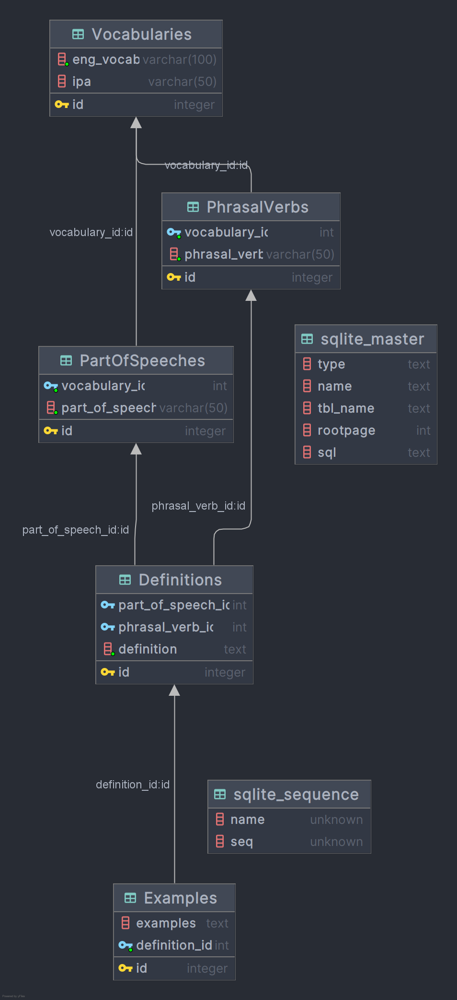

## Đoạn code dùng để thêm dữ liệu vào sqlite database (sử dụng Exposed và Kotlin)
## Database diagram:

## The piece of code to add to sqlite database (using Exposed and Kotlin)
## Database diagram:

